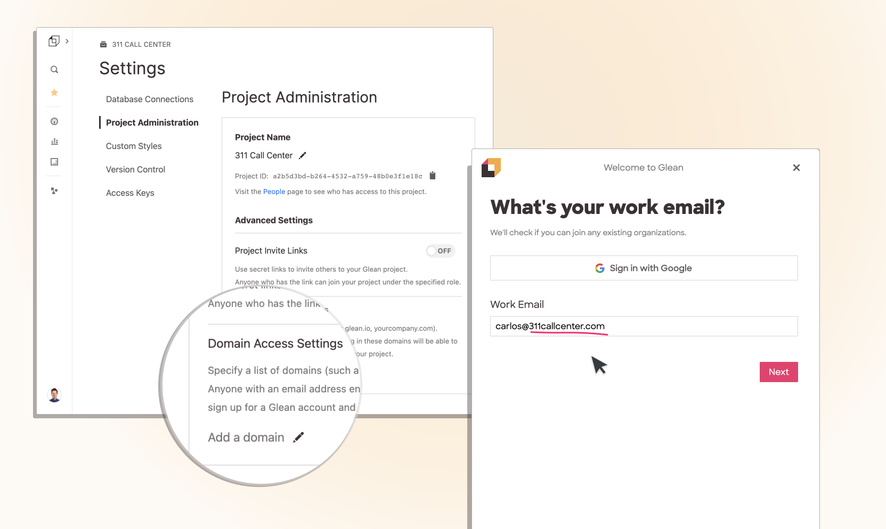

# December 27th, 2022

Happy New Year and Happy Holidays friends of Glean!

We’ve had an amazing year: the Glean team has doubled in size (to 12 employees) as we've been increasing our user and customer base (more than 3x).  We were queuing up a lot of changes so we wanted to get a note out before the New Year.

Here are some highlights from the end of the year:

- **Access domains**
- **Restore deleted items**
- **Filter on metrics and alerts**
- **Resource history**
- **Other improvements and fixes**: DataOps speed and visualization features, faster load times, chart images

---

## Get your team into Glean with Access Domains

{alt="Screenshots of configuration screen for how to setup domain access as well as how users configure it."}

No more velvet rope - your whole team can access your Glean project by configuring your organization’s email domain.  Go to the settings page in your project and configure your organizations domain (e.g. yourcompany.com) as an Access Domain to automatically let people with valid emails into your project.

---

## Restore deleted resources from the Trash

Your project now has a Trash where you can recover deleted items.  We hope this makes cleaning up your project easier and safer.  You can delete and restore entire collections of resources or individual resources.  You can still view and interact with  items in the trash but they won’t show up in your collections or in search.  Check out the new trash page in your project.

---

## Filter on metrics and alert your team to metric changes

Metric filters allow you to surface the most important data points in your tables.  You can filter to customers with a certain number of active users, or filter to tests that are failing above 95% of the time.  You can also use metric filters as alerts: schedule a report to only send when there are tests that are failing above your 95% threshold.  Then you can schedule an email (and soon Slack) report to trigger when tests.

---

## Resource Lineage 

### DAGs help you see dashboard and model lineage

If you’ve ever wanted to quickly edit a metric definition from a dashboard, or see which dashboards a model is being used in - then the new Resource Lineage has your back!  Click the carat next to any resource and select Resource Lineage.  This works for Saved View, Data Models and Dashboards - a quick visualization will show all of the other upstream and downstream dependencies.

---

## Other improvements and fixes:

- **Configure every visualization with DataOps** - as of this month every visualization feature can be configure through DataOps.
- **Faster initial loading times** - we’ve improved our serving architecture so your first load of Glean should be about 2x faster.  You’ll notice this mostly when you first login.
- **Download chart image** - select the three dots and download any Saved View as a .png.
- **DataOps speed improvement** - we improved caching when rebuilding models in DataOps, you’ll notice a large improvement especially in large projects..
- **Improved granularity constraints** - you can now constrain granularities in data models - so if you’ve aggregated data to the month level - you can now fix a data model to only aggregate by month.

---

## What’s next?  Check out our public roadmap
Check out our [product roadmap](../product-roadmap/index.md) to see what we're up to long term, let us know if you have any feedback or if we’re missing anything!
