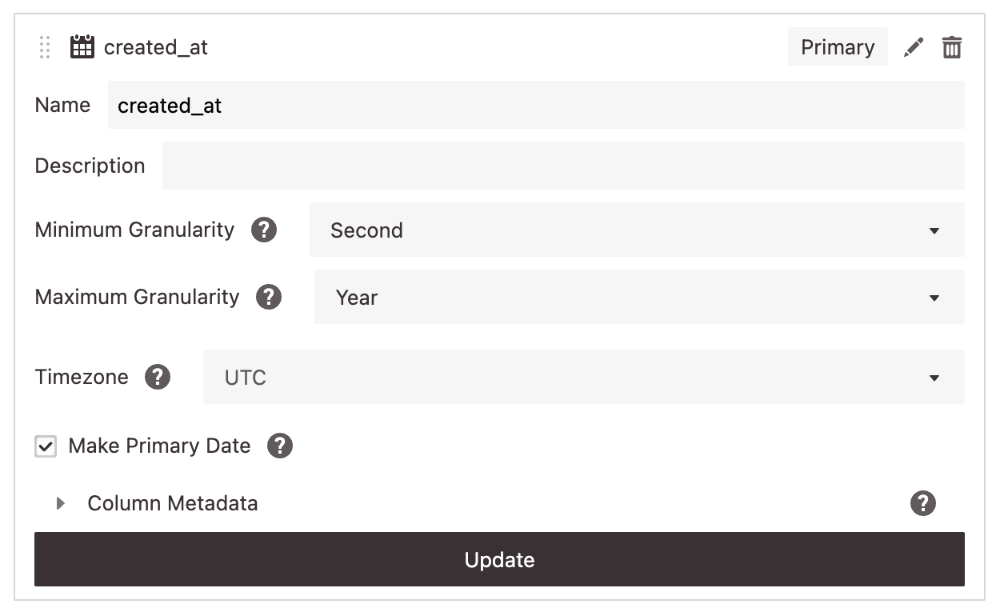

!!! info "Coming soon!"

    This feature is coming soon, and will be gradually rolled out to all users.

# Project-level datetime settings

There are several datetime-related settings that can be customized at the project level.

## Project Default Timezone

This determines the timezone that will be used for all resources and for all members of the project. The timezone setting determines several things:

- The timezone in which datetimes will be displayed
- The timezone used to determine the start of each bin when using a datetime granularity
- The timezone used to determine the start of a filter when "start of {granularity}" is selected

Here are a few examples:

1. With project timezone set to `US/Eastern`, a filter for "last month" will include values between:
    - Midnight `US/Eastern` on the first day of last month, and
    - Midnight `US/Eastern` on the first day of this month.

2. With project timezone set to `UTC`, a weekly granularity will group the data into bins where each bin contains values between:
    - Midnight `UTC` on the first day of the bin's week, and
    - Midnight `UTC` on the first day of the next week.

3. With project timezone set to `America/Los_Angeles`, a filter of `Jan 1, 2020 - Jan 8, 2020` will include values between:
    - Midnight `America/Los_Angeles` on 2020-01-01, and
    - Midnight `America/Los_Angeles` on 2020-01-08.

## Project Default First Day of the Week

This determines which day will be used as the first day of the week for all resources and for all members of the project. The first day of the week is used in two areas:

- The day used for start of week in filters for "N weeks ago" with "start of week" selected
- The day used for start of week when using weekly granularity

Here are a few examples:

1. When set to `Monday`, a filter value of "10 weeks ago" with "start of week" selected will be interpreted as the start of the week 10 weeks ago, where weeks begin on Monday.

2. When set to `Saturday`, a weekly granularity will group the data into bins where each bin contains values between:
    - The start of the first day of the bin's week (Saturday), and
    - The start of the first day of the next week (Saturday).

!!! warning "Caveats"

    At this time, project members cannot override these project-level datetime settings, (e.g. to view a chart in their local timezone), and this setting cannot be overriden for specific resources (e.g. to use a different first day of the week for a certain chart).

# Column-level datetime settings

There is also a column-level setting for datetime Attributes that are timezone-naive.

When a column is timezone-naive, Glean doesn't know which timezone to use to interpret its values. So, for these columns, there's a "Timezone" setting in the attribute settings:

{: style="max-width:80%"}

This value determines the timezone in which Glean will interpret the column's values.

For example, let's say we have a column with timezone-naive datetime values:

|*column values*|
|---|
|`2020-01-02 03:45:06.789`|
|`2020-03-04 05:06:07.890`|
|`2023-01-01 00:00:00.000`|

If the `timezone` setting for this column is set to `UTC`, they will be interpreted like this:

|*interpreted in `UTC`*|
|---|
|`2020-01-02 03:45:06.789 UTC`|
|`2020-03-04 05:06:07.890 UTC`|
|`2023-01-01 00:00:00.000 UTC`|

However, if the `timezone` setting for this column is set to `US/Eastern`, they will be interpreted like this:

|*interpreted in `US/Eastern`*|
|---|
|`2020-01-02 03:45:06.789 US/Eastern`|
|`2020-03-04 05:06:07.890 US/Eastern`|
|`2023-01-01 00:00:00.000 US/Eastern`|

If we display those values in `UTC`, it's easy to see that they've been interpreted as different points in time:

|*interpreted in `UTC`*|*interpreted in `US/Eastern`, displayed in `UTC`*|
|---|---|
|`2020-01-02 03:45:06.789 UTC` | `2020-01-02 08:45:06.789 UTC`|
|`2020-03-04 05:06:07.890 UTC` | `2020-03-04 10:06:07.890 UTC`|
|`2023-01-01 00:00:00.000 UTC` | `2023-01-01 05:00:00.000 UTC`|

!!! info "Note"

    Glean's "underlying data" feature does not interpret timezone-naive values, so this setting is not applied when using that feature.
