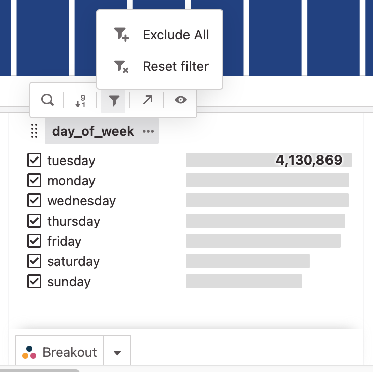

The attributes tray is the control panel for your chart data.

By default, there is one tile for each attribute in your data model in your attributes tray. You can scroll left and right to reveal all of the attributes. The attributes tray immediately allows you to see the metric values for your data as well as filter and breakout data. There are a few actions which every attribute panel allows you to do:

1. Breakout an attribute as a series
2. Filter for specific attribute values
3. See metric values for each item immediately

<!-- There is also some type specific behavior for attributes. -->

## Hiding and Unhiding Attribute Tiles

You can choose which attributes are visible in the attribute tray. There are few different ways to do this:

1. From the right-hand drawer, select the `Model` tab, and click the eye icons to hide and show tiles.
2. From top right of the `Attributes` tray, click the `+`, and click the eye icons to hide and show tiles.
3. Click the title of a tile or the `⃛` next to the title and click the eye to hide the tile.

## Attribute Filters

Attribute filters are applied across the entire explorer - filtering every other attribute, the numeric total, and the chart for the values selected in the attribute pane.

### Filtering

The default state for an attribute tile is the filtering mode. Checkboxes next to each attribute item indicates whether the item is included (shown in the view) or excluded (filtered out).

1. Hover over an attribute item
1. To exclude the item, click the item
1. To include just that item, click the icon at the base of the item's metric bar

### Include vs. Exclude filter

- **Exclude Items**: By default, all items are included. Click an attribute item to uncheck the box and exclude it.
- **Include Items**: If instead, you want to only include a specific set, click the tile's title, the filter icon, then `Exclude All`. All the checkboxes will be emptied and you can select specific items to include.

{: style="max-width:50%"}

## Attribute Breakout

Adding an attribute as a breakout allows you to layer the attribute onto the current chart. The attribute becomes a grouping of the chart. This is a good way to see changes in the distribution of the attribute over time (or over another numeric interval).

To add an attribute as a breakout:

1. Hover over any attribute panel
2. Select the breakout button on the bottom of the panel [Breakout](Breakout.md)
3. To add and remove broken out items, just click on a row

## Sorting Attributes

By default, string attributes are sorted by a metric in descending order. To change the order, click the attribute tile's title, then click the sorting icon to see sorting options.

Breakouts can be reordered manually by dragging the attribute items.

{: style="max-width:50%"}

Some notes on sorting attributes:

- If there are a lot of unique items in your list, only the first subset of items are retrieved from the database. Changing the sort order may trigger an additional database query to retrieve the new top of the list.
- Even if there are a lot of items in your list, you can keep scrolling and Glean will automatically pull additional items into the attribute pane as you keep scrolling. 
- `NULL` values are sorted at the end of a list in descending order (and the top of a list in ascending order).
- Behavior of numeric fields is different than strings, see below.

## Numeric Attributes

Numeric attributes have a few distinct features and differences from the default behaviors of string attributes.

### Numeric Binning

Attributes are grouped into numeric buckets if binning is turned on for the attribute. The beginning of the range is inclusive and the end value of the range is exclusive. For example for a bucket that is `20 - 25` the bucket represents all items that are equal to or greater than twenty and less than twenty-five. You can filter binned numeric data just like you would filter all other attributes and all values in buckets are filtered (or excluded) as you would expect.

The bin size is adjustable via the attribute tile title menu.

### Sorting

Unlike string, numeric attributes are sorted by their numeric values. This lets you easily see the numeric distribution of the attribute.

### Range Filters

It is possible to apply a numeric range filter to a numeric attribute by dragging a chart - see the filtering section for additional details.

If a range filter is applied, you can see which values are affected in the attribute panel, but it is not possible to change the range filter from the attribute panel. This is because a range is incompatible with the idea of selecting specific range items.

## String Attributes

String attributes are alphanumeric attributes and can have very high cardinality (say, millions of unique items). String attributes are searchable to make finding specific attributes easy.

To search for a specific item in a string attribute, click the search icon in the attribute tile title menu.

!!! info

    While searching through a string field is supported, Glean is not optimized for full-text document search.  This means that searching through human written comments and long documents is probably not a good idea (mostly it will be slow and potentially costly depending on how those documents are stored in your database).
