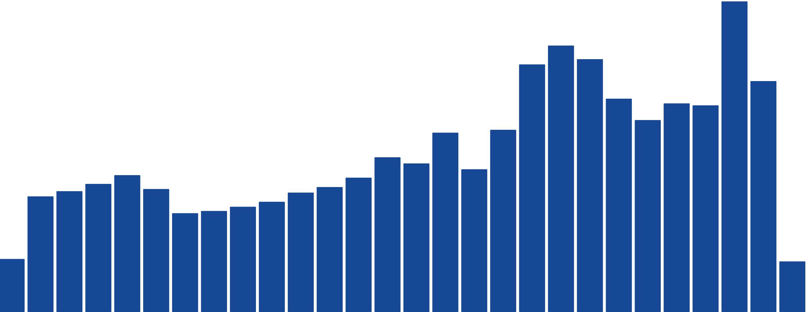

Breaking out an attribute in Glean splits the visualization by the categories in that attribute. In a timeseries bar chart for example, you can map color to an attribute.

## Adding and removing a breakout

- **From the Attribute Panel:** The easiest way to break out by an attribute is to select the Breakout button from any attribute panel in the [Attributes tray](Attributes-Tray.md).
- **From the top Control Bar:** You can quickly view or remove a breakout from the top control bar just about your chart.
- **From the Controls Panel:** As with other data configurations, you can always view and remove a breakout by clicking the `Controls` tab on the right-hand panel.

## Adding breakout items

Glean visualizes the top six items in your attribute by default, the rest of the items are bucketed together into an `Other` category. This allows you to visualize the distribution of very high-[cardinality](https://en.wikipedia.org/wiki/Cardinality) columns easily. You can always add more groups if you want in the attribute panel, but generally, you shouldn't visualize too many items at a time - this is why we pick a low number as a default. You can control the number of groups from the attribute panel, see the [Attributes tray](Attributes-Tray.md) page for more details.

## Color Breakout

Colors for your series are selected by Glean based on a palette.

with a range of colors that is designed to vary by hue and luminosity so that it's easy to tell groups apart.

The color scale is not optimized for more than six groups, although we'll try to do something reasonable with any number of groups.

Glean does not yet support customizing chart colors.

## Break out into multiple charts (trellis charts)

Breaking out into multiple charts allows you to create a trellis chart, a series of separate sub-charts for each category in the attribute. This type of breakout is known as faceting, a trellis plot, or small multiples.

A trellis chart makes it easy to compare different slices of your data side-by-side, which can be easier to interpret than a chart like a stacked bar chart.

Trellis charts can be particularly effective when combined with a color breakout or multiple metrics.

{: style="max-width:75%"}

In the attribute panel, click the arrow on the right side of the Breakout button to break out into multiple charts.

## Hiding the `Other` category

Sometimes you might want to hide the other category to make the comparison between items more clear. To hide the other category click the `hide other` button at the bottom of the attribute tray or in the control panel.
