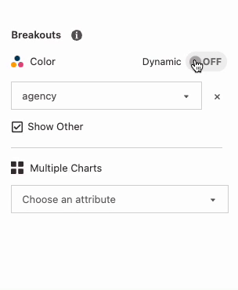

Breaking out an attribute in Glean splits the visualization by the categories in that attribute. In a timeseries bar chart for example, you can map color to an attribute.

## Adding and removing a breakout

- **From the Attribute Tile:** The easiest way to break out by an attribute is to select the Breakout button from any attribute tile in the [Attributes tray](Attributes-Tray.md).
- **From the Top Control Bar:** You can quickly view or remove a breakout from the top control bar just above your chart.
- **From the Control Panel:** As with other data configurations, you can always view and remove a breakout by clicking the `Controls` tab on the right-hand panel.

## Adding breakout items

Glean visualizes the top six items in your attribute by default; the rest of the items are bucketed together into an `Other` category. This allows you to visualize the distribution of very high-[cardinality](https://en.wikipedia.org/wiki/Cardinality) columns easily. You can always add more groups if you want in the attribute tile, but generally, you shouldn't visualize too many items at a time - this is why we pick a low number as a default. You can control the number of groups from the attribute tile – see the [Attributes tray](Attributes-Tray.md) page for more details.

## Color Breakout

Colors for your breakouts are selected based on a color palette. The default palette is named `Twilight` and has been designed with a range of colors to vary by hue and luminosity so that it's easy to tell groups apart.

You can also create and use your own [custom color palettes](../project-management/custom-styles.md).

## Break out into multiple charts (trellis charts)

Breaking out into multiple charts allows you to create a trellis chart, a series of separate sub-charts for each category in the attribute. This type of breakout is known as faceting, a trellis plot, or small multiples.

A trellis chart makes it easy to compare different slices of your data side-by-side, which can be easier to interpret than a chart like a stacked bar chart.

Trellis charts can be particularly effective when combined with a color breakout or multiple metrics.

{: style="max-width:75%"}

In the attribute tile, click the arrow on the right side of the Breakout button. You can then break out into multiple charts from the options listed. Trellising is currently only enabled for area, bar, and line charts.

## Hiding the `Other` category

Sometimes you might want to hide the `Other` category to make the comparison between the breakout items more clear. To hide the other category, click the `Other` button in the attribute tile or under the `Breakout` section in the control panel.

## Dynamic Breakouts

Breakouts are helpful for understanding which items in an attribute are the most significant contributors to a metric, and very often you'll want to track changes in this attribute as data changes or filters are applied. To do this, turn on dynamic breakouts in the control pane under `Breakout`.

{: style="max-width:75%"}

Dynamic breakouts update themselves depending on a rule you define:

1. Sorting by the metric: if you want to breakout by the top six customers by revenue, breakout `customers` then sort by `revenue` descending.
2. Sorting by the attribute's values: if you want to breakout by the last 6 months of `start_date`, breakout `start_date` then sort by `start_date` descending.

You can also easily change the number of items you want in your breakout by changing `Limit`. Similarily, create a dynamic trellis by toggling the dynamic breakout option for your trellised attribute.

The items in your breakout or trellis will change whenever your data changes-- for example, whenever you add or remove filters, or whenever new data comes in.
