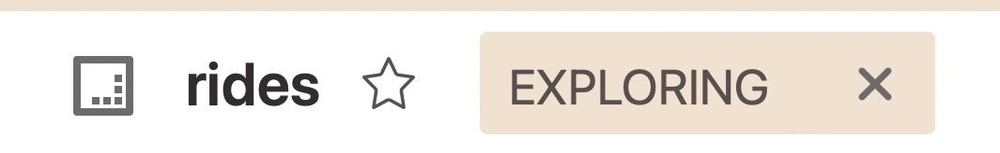
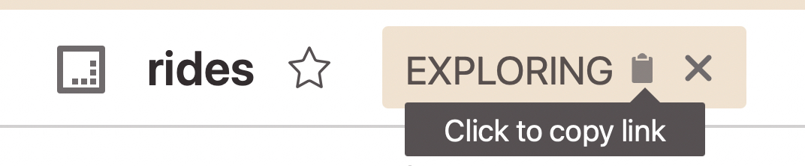

Saved Views and Data Models are often starting points for further exploration and analysis. Glean makes it safe and easy to take resources further and share what you've found with the `Explorations` feature.

## Starting and resuming an exploration

{: style="max-width:50%"}

Whenever you begin making changes to a resource in the `Explorer`, Glean will track your changes and give them unique URLs.

Click the `X` in the `Exploring` chip to reset back to the resource's default view at any time. Glean will save your place for each resource for you to return to later.

If you've explored a resource before, you will see an option to resume your last `Exploration` for that resource.

{: style="max-width:50%"}

## Sharing an exploration

{: style="max-width:50%"}

In the `Explorer`, you can always click the `Exploring` chip to copy the URL for your current exploration to the clipboard. You can also simply copy the URL from the address bar of your browser.

When someone else accesses your link, they will be brought to the resource with your `Exploration` applied. They will see a color header and the name of the person who shared their `Exploration`.

{: style="max-width:50%"}

!!! Warning

    While an `Exploration` link contains configurations such as [Breakouts](./Breakout.md) and [Filters](./Filter.md), it does not freeze and preserve the underlying data. If someone accesses an `Exploration` and the underlying data has changed, they might not see what was intended.
