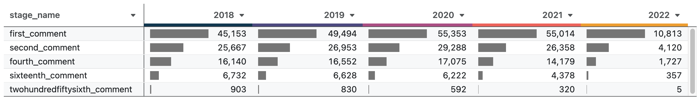

# Guide: Create a Funnel Visualization


Funnel charts are used to understand how far users progress through a conversion funnel, a series of pre-defined steps leading up to a conversion event.

Since each step precedes the next, the user count is highest at the beginning and tapers down to the number of users who convert, creating a funnel shape.

Like [retention curves](../create-retention-curves/index.md), including user-level attributes, such as experiments and other cohorts, can be useful to compare effects on the conversion funnel.

For this walk-through, we're going to look at the user engagement on the tech news aggregation website Hacker News. The dataset is available on BigQuery's public datasets and is kept up to date.

## Prepare data

As with all tools you build in Glean, conversion funnels will be as powerful as the data model you produce for them. For large user tables, it probably makes sense to prepare this data in your data warehouse, but it's also possible to measure funnels on the fly using a SQL-based data model.

To prepare our funnel, we will define a set of steps in a funnel and then check whether a user made it to each stage.

| username     | cohort_year | post_count | stage_name     | in_stage |
| ------------ | ----------- | ---------- | -------------- | -------- |
| carlos@glean | 2020        | 30         | first_comment  | 1        |
| carlos@glean | 2020        | 30         | second_comment | 1        |
| carlos@glean | 2020        | 30         | fourth_comment | 1        |
| crys@glean   | 2021        | 3          | first_comment  | 1        |
| crys@glean   | 2021        | 3          | second_comment | 1        |
| crys@glean   | 2021        | 3          | fourth_comment | 0        |

```sql
with user as (
  select
    `by` as username,
    extract(YEAR from min(timestamp)) as cohort_year,
    count(distinct id) as comment_count
  from
    quickstart.hacker_news_activity
  where
    type = 'comment'
  group by
    1
),
stage as (
  select 'first_comment' as stage_name, 1 as required_min_count
  union all
  select 'second_comment' as stage_name, 2 as required_min_count
  union all
  select 'fourth_comment' as stage_name, 4 as required_min_count
  union all
  select 'sixteenth_comment' as stage_name, 16 as required_min_count
  union all
  select 'twohundredfiftysixth_comment' as stage_name, 256 as required_min_count
)

select
  username,
  cohort_year,
  if(length(username)>10,'long','short') as cohort_nameLength,
  comment_count,
  stage_name,
  IF(comment_count >= required_min_count, 1, 0) as in_stage
from
  user, stage
where cohort_year>extract(YEAR from current_date()) - 5
```

A few notes on the resulting columns:

- **username** - this is a string representing our user
- **cohort_year** - this is the year a user first commented
- **cohort_nameLength** - whether a username is longer than 10 characters
- **comment_count** - the total number of comments by a user
- **stage_name** - the name of the funnel stage. in this example, it is the number of comments made by the user
- **in_stage** - a row is created for every stage for every user. `in_stage` indicates whether the user is in the stage

## Create the data model in Glean

1. From the Glean homepage, click [Add Data Model](<[Add-Data-Model](https://glean.io/app/mb)>){:target="\_blank"}
   1. see [Add Data Model](../../docs/data-modeling/add-data-model.md) for documentation on adding a data model
2. Either select your prepared retention table from your data warehouse or enter a SQL query similar to the one above as the basis for your model.
3. Add attributes and metrics for your funnel's model in Glean:
   - Add `cohort_year`, `cohort_nameLength`, and `comment_count` as attributes along with any experimental cohort attributes you prepared in your data.
   - Add **User Count** as a custom metric, this will be the metric used in the visualizations
     ```sql
     COUNT(DISTINCT IF(in_stage = 1, username, null))
     ```
4. Click `Save Model`
5. Click `Open in Explore`

## Create funnel view

### Create funnel bar chart


1. Change the chart type to `Horizontal Bar`
2. Select `stage_name` as the rows
3. Select `user count` as your metric
4. Click into the `control` tab on the right-hand side

   1. Select `Show Bar Labels`
   2. Sort rows by `user count` descending

5. Select `Breakout` or `Filter` on a cohort attribute to see how different cohorts progress through the funnel.

### Create funnel table

The table view allows you to calculate and display additional metrics for your funnel.


1. Change the chart type to `Table`
2. Select `stage_name` as the rows
3. Select `user count` as your metric
4. Select `Add a Calculation` in the metric dropdown
   1. Add a metric with a `Difference` calculation to see the drop off at each stage
   2. Add a metric with a `Percent Change` calculation to see the drop off at each stage
5. Click into the `Controls` tab on the right-hand side
   1. Add a visualization with type `Bar` to the `user count` field
   2. Sort rows by `user count` descending

### Create funnel pivot table

The pivot table view allows you to see funnels broken out by attribute, in parallel.



1. Change the chart type to a `Pivot`
2. Select `stage_name` as the rows
3. Select `user count` as your metric
4. Click into the `control` tab on the right-hand side
   1. Add a visualization with type `Bar`
   2. Sort rows by `user count` descending
5. Select `Columns` or `Filter` on a cohort attribute to see how different cohorts progress through the funnel.
