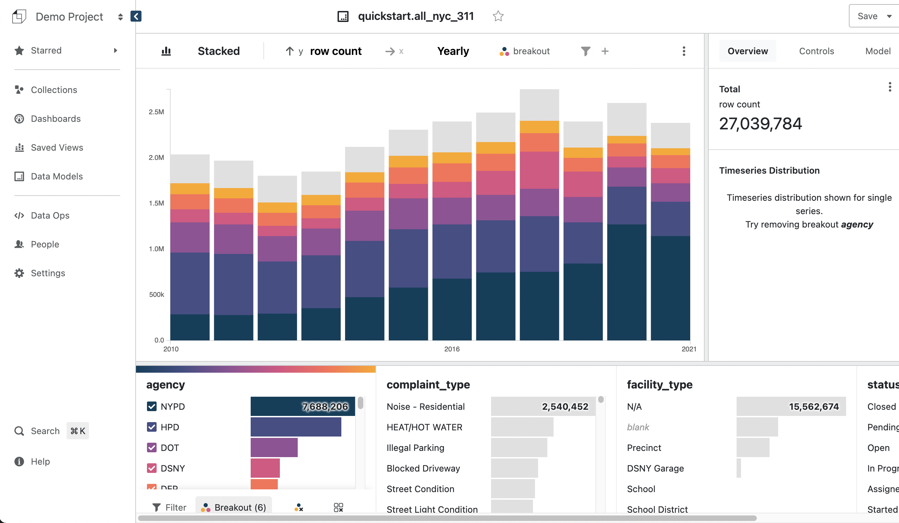

This guide will take you from defining data models to exploring data and sharing data with your team.

Once you get access to Glean, you will be invited to login to a project. Users can belong to multiple projects, but data cannot be shared between projects.  So users, permissions, database connections, data models and every other resource is isolated in the context of a project.  Typically your entire organization can be managed in a single project.

## 1. Add a database connection

Also see [database connections](../../docs/database-connections/) for configurations specific to different database types.

!!! warning "Firewall Configuration"

    Your database must be accessible from our systems at `18.210.29.198`

{: style="max-width:75%"}

1. [Go to the `Settings` page](https://glean.io/app/p/settings){:target="_blank"}
2. Click `+ New Database Connection`
3. Select the type of database; either Athena, BigQuery, Snowflake, Postgres or Redshift
4. Enter the credentials according to your type of database
5. Click `Test` to test your connection
6. Click `Add` to complete the process

## 2. Define a data model

Every chart and analysis is based on a Glean data model. A data model is a table (or virtual table).

{: style="max-width:75%"}

1. [Go to your `project homepage`](https://glean.io/app/) and click `New Data Model`
2. Select a database connection, table, and click `Create Model`

    !!! info "Using a SQL Query"

        Each Glean data model is based on an underlying data table. If the data in your data isn't quite in the right format, it's possible to specify an underlying query as the basis for your data model.
        
3. Define the data model
    1. Edit the name of the data model by clicking the edit button `✏️` next to the name
    2. Click `>` to add a source column to the data model
       1. Add a dates to your data model
       2. Add attributes to your data model) 
    3. Add metrics to your data model (see [`Metrics`](../../docs/data-modeling/Metrics))

4. Click `Publish`.  Glean will send you into your data explorer

## 3. Start interacting with your data

{: style="max-width:75%"}

1. [Go to the `Data Models` page](https://glean.io/app/p/data-models){:target="_blank"}
2. Click on the name of the data model we just created

!!! success "Congratulations"

    You're ready to begin interacting with your data

    Next, [learn how to use the `Attributes Tray`](../../docs/visualizing-data/Attributes-Tray.md) to filter and breakout your data
