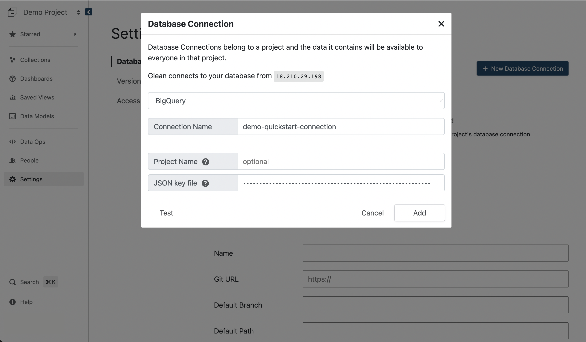

The objective of this quickstart is to have you begin interrogating your data and sharing results *today*.

Once you sign up for Glean, you will be invited to login to a project. A project is where your data analysis and visualization live. You can invite people, setup database connections and manage your project by clicking on your project name.

## 1. Add a database connection

Once you add a database connection, you'll be able to specify tables, SQL queries, and metrics to visualize in Glean.

!!! warning "Firewall Configuration"

    Your database must be accessible from our systems at `18.210.29.198`

{: style="max-width:75%"}

1. [Go to the `Settings` page](https://glean.io/app/p/settings){:target="_blank"}
2. Click `+ New Database Connection`
3. Select the type of database; either Athena, BigQuery, Snowflake, Postgres or Redshift
4. Enter the credentials according to your type of database
5. Click `Test` to test your connection
6. Click `Add` to complete the process

!!! info

    [More about database connections](../../docs/database-connections.md)

## 2. Define a data model

Every chart and analysis is based on a Glean data model. A data model is a table with at least one date and some attributes.

{: style="max-width:75%"}

1. [Go to your `project homepage`](https://glean.io/app/) and click `New Data Model`
2. Select a database connection, table, and click `Create Model`

    !!! info "Using a SQL Query"

        Ideally, each Glean data model is based on an underlying data table. If the data in your database isn't quite in the right format, it's possible to specify an underlying query that will run as you explore data.
        
3. Define the data model
    1. Edit the name of the data model by clicking the edit button `✏️` next to the name
    2. Click `>` to add a source column to the data model
       1. Add a dates to your data model
       2. Add attributes to your data model) 
    3. Add metrics to your data model (see [`Metrics`](../../docs/data-modeling/Metrics))

4. Click `Publish >`

## 3. Start interacting with your data

{: style="max-width:75%"}

1. [Go to the `Data Models` page](https://glean.io/app/p/data-models){:target="_blank"}
2. Click on the name of the data model we just created

!!! success "Congratulations"

    You're ready to begin interacting with your data

    Further Reading:

    - To learn more about how you can interact with your data
    - to learn how to create specific types of analyses