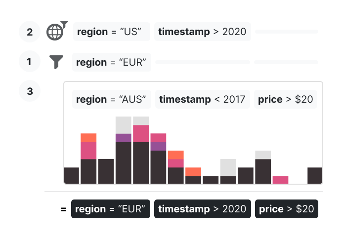

Dashboard filters can be used to filter multiple charts or metrics at once.
You can specify the default value for each filter that you add, or leave it
blank to allow viewers to specify the filter only when they wish to.

If there are specific charts or metrics that you would like the filters to ignore,
you can check the "Ignore Dashboard Filters" setting in their configuration menu.

## Editing Filters

Filters can be added to the dashboard globally or to any section once there are
charts or metrics which can be filtered. Click the `+` button then select the
attribute or timestamp you wish to filter on. You can remove a filter by clicking
the `X` icon next to it.

You can click one a specific filter to edit its value. When editing a dashboard,
any value set here will become the default value for the filter when viewers
load the dashboard.

## Filter Hierarchy

Filters exist at three levels. When filters from different levels overlap,
they are prioritized as such:

1. Section Filters
2. Global Filters
3. Saved View / Metric Filters

Note that filter rules do not combine together - a more permissive filter will
take precedence and override less permissive ones.

## Filter Synchronization

Dashboard filters are automatically synchronized based on the underlying column name of your attributes. For example, if you have two data models, each with an attribute based on a `customer_id` field, you only need to
add one filter to the dashboard, and it will filter both data
models by the provided value.
